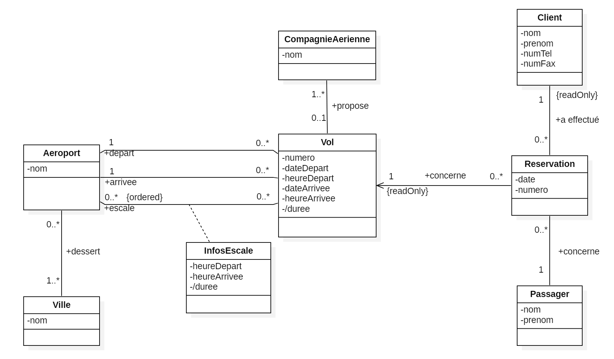

Université Claude Bernard Lyon 1 - Master 1 informatique - Gestion de projet et génie Logiciel 

<!-- BEGIN CUT -->

<!-- END CUT -->

# TD Design Patterns

L'exercice ci-dessous est en partie tiré de l'ouvrage suivant : [UML2 par la pratique - Études de cas et exercices corrigés](https://www.eyrolles.com/Informatique/Livre/uml-2-par-la-pratique-9782212120141/).

<!-- BEGIN CUT -->
**Remarque** : vous pouvez visualiser les solutions en plaçant votre pointeur sur les paragraphes prévus à cet effet. Il est important de noter que ces solutions indiquent des modélisations possibles et non LES solutions uniques aux questions posées.
<!-- END CUT -->

## &Eacute;tude d'un système de réservation de vols

Cette étude de cas concerne un système simplifié de réservation de vols pour une agence de voyages.
Les interviews des experts métier auxquelles on a procédé ont permis de résumer leur connaissance du domaine sous la forme des phrases suivantes :

1.  Des compagnies aériennes proposent différents vols.
2.  Un vol est ouvert à la réservation et refermé sur ordre de la compagnie.
3.  Un client peut réserver un ou plusieurs vols, pour des passagers différents.
4.  Une réservation concerne un seul vol et un seul passager.
5.  Une réservation peut être annulée ou confirmée.
6.  Un vol a un aéroport de départ et un aéroport d’arrivée.
7.  Un vol a un jour et une heure de départ, et un jour et une heure d’arrivée.
8.  Un vol peut comporter des escales dans des aéroports.
9.  Une escale a une heure d’arrivée et une heure de départ.
10. Chaque aéroport dessert une ou plusieurs villes.

L'objectif de l'exercice est de mettre au point un modèle statique d’analyse (aussi appelé modèle du domaine) à partir de ces « morceaux de connaissance », et d'aboutir à un diagramme de classes UML.

Une première partie de cet exercice consiste à définir les classes, leurs attributs et les associations de ce modèle. Pour chacune de ces phrases, cette étape est riche en questionnements et en discussions et nous vous encourageons à la réaliser en marge de ce TD. Pour vous faire gagner du temps, une solution possible (mais ce n'est pas la seule) vous est fournie ci-dessous :

Dans ce TD, nous allons partir de cette modélisation partielle et la développer pour appliquer des design patterns.

## Principes GRASP

Dans cette partie, on se focalisera sur le modèle d'analyse et aura pour objectif d'obtenir une modélisation aussi générique et réutilisable que possible.

1. Utiliser les principes d'affectation des responsabilités pour rajouter les opérations correspondant aux phrases 2 et 5.

<!-- BEGIN CUT -->

Solution

Phrase 2 : "Un vol est ouvert à la réservation et refermé sur ordre de la compagnie" -> 2 possibilités : ajouter des méthodes dans CompagnieAerienne ou dans Vol. Analyse en termes de responsabilités : 
	&Agrave; qui incombe la responsabilité de gérer les données liées à l'ouverture ou à la fermeture aux réservations ? C'est une information spécifique à chaque instance de Vol ; elle doit donc être encapsulée dans cet objet. On applique ensuite le pattern expert : si la donnée est dans Vol, Vol est l'expert en information concernant les opérations de modification de cette donnée -> On ajoute des méthodes ouvrirReservation() et fermerReservation() à Vol. Il faut donc traduire la phrase 2 en "CompagnieAerienne envoie un message à (i.e. appelle une méthode de) Vol". 
	<strong>Remarque</strong> : pourquoi ne pas ajouter un champ booléen "ouvert" (ou fermé) à Vol, en même temps que ces méthodes ? Cela reviendrait à modéliser un état instantané de l'objet. Pour cela, il est plutôt conseillé de faire un diagramme dynamique ad hoc (diagramme d'états) que de le mettre dans un diagramme statique de classes. Il existe aussi un "State Pattern", mais qui est plutôt un pattern de comportement, et s'applique plus aux modèles d'implémentation que d'analyse. 
	Avec le même raisonnement, on ajoute les méthodes confirmer() et annuler() à Reservation.

<!-- END CUT -->

2. En utilisation "normale" du SI, quelles sont les classes dont on créera régulièrement des instances ? Pour chacune de ces classes, quelles sont celles qui seront chargées de les créer ?

<!-- BEGIN CUT -->

Solution

Pattern Créateur : 
	- CompagnieAerienne crée des Vol ( expert en information nécessaires à la création) 
	- Client crée des Reservation (expert en information (lui-même, le passager) ; pas sûr que ce soit le client qui confirme/annule la résa) 
	- Reservation crée des Passager (enregistre / possède un champ Passager) 
	- Pour Client, pas de bon candidat -> il faut une Fabrication Pure qui représente le système de réservation de l'agence de voyage

<!-- END CUT -->

3. Il y a dans le diagramme ci-dessus une classe qui a trop de responsabilités. Comment faire pour améliorer cet élément de la modélisation ?

<!-- BEGIN CUT -->

Solution

Pattern Forte Cohésion : 
	- Amélioration : 
	  &nbsp;&nbsp;- séparer Vol en 2 : VolGenerique (numéro de vol, départ, destination, escales, heure de départ et d'arrivée + jour de la semaine) et Vol (dateDepart, dateArrivee + collection de Reservations). Voir explications p. 100 & 101. 
	  &nbsp;&nbsp;- distinguer les compagnies qui affrêtent le vol de celle qui l'opère (le numéro de vol contient son code) et faire 2 nouvelles associations : entre VolGenerique et Vol (nommée "décrit") et entre CompagnieAerienne et Vol ("affrête").  
	- Remarques : 
	  &nbsp;&nbsp;- Vol N'est PAS une sous-classe de VolGenerique (le nom est trompeur). 
	  &nbsp;&nbsp;- le pattern de "métaclasse" présenté dans le livre n'est pas référencé comme un DP ; une métaclasse est définie comme une classe dont les instances sont des classes. On se limitera à dire que c'est une Fabrication Pure.

<!-- END CUT -->

4. Réaliser une décomposition en packages en favorisant la réutilisabilité et l'indépendance de ces packages

<!-- BEGIN CUT -->

Solution

Pattern Faible Couplage : 
	Analyser la navigabilité entre les classes pour ne pas avoir de dépendances croisées entre les packages, ce qui les rend interdépendants et donc non réutilisables. 
	On peut déjà faire un package Geographie (navigable uniquement dans un sens : du point de vue du SI de l'agence de voyage, l'aéroport n'a pas besoin de savoir quels vols le concernent). 
	Pour le reste, 2 Possibilités : 
	1) Regrouper en fonction de la sémantique des objets : 1 package Reservations (Reservation, Client, Passager) & 1 package Vols (CompagnieAerienne, VolGenerique, Vol) 
	2) Regrouper par cycles de vie des objets (VolGenerique est beaucoup plus stable que Vol) : 1 package Reservations (Vol + Reservation, Client, Passager) & 1 package Vols (CompagnieAerienne, VolGenerique)  
	Analyse des 2 solutions du point de vue de la navigabilité : 
	Dans la solution 2, l'association CA (affêteur) propose Vol est navigable dans un sens, et Vol doit connaître son VolGenerique (navigable dans l'autre sens) 
	Dans la solution 1, la navigabilité ne se fait que dans un sens (une seule association entre Reservation et Vol ; une Reservation doit connaître son Vol, mais un Vol n'a pas besoin de connaître ses reservation) 
	-> On choisit la solution 1.

<!-- END CUT -->

5. Pour des raisons d’organisation sur le projet, nous avons la contrainte suivante : le package Vols doit dépendre du package  Reservations, et non l’inverse. Proposez une modification minimale des diagrammes de classes précédents permettant de se conformer à cette contrainte.

<!-- BEGIN CUT -->

Solution

Appliquer une "inversion de dépendance" : 
	Mettre en place une interface "I_Voyage" qu'implémentera Vol et qui sera dans le package Reservations. La navigabilité entre les packages se fera alors dans l'autre sens.

<!-- END CUT -->

6. Généraliser la modélisation et réutiliser autant que possible les packages pour proposer un système de réservation de voyages en bus. Fusionner autant que possible les 2 modélisations.

<!-- Remarque : cette partie est un peu longue et fastidieuse ; elle peut être rapidement évoquée à l'oral.
	Méthode :
	  - Isoler les classes communes dans de nouveaux packages, afin de pouvoir les réutiliser.
	  - Factoriser les propriétés communes dans des classes abstraites.
-->

<!-- BEGIN CUT -->

Solution

Classes similaires : 
	  - Vol -> VoyageBus 
	  - CompagnieAerienne -> Voyagiste 
	  - Escale -> Arret 
	Packages : 
	  - Reservations (package généralisé) : contient une classe abstraite Reservation 
	  - ReservationBus et ReservationVols (packages spécialisés) : contienent des sous-classes spécifiques aux domaines et dépendent de Reservations (héritage) ; dépendent aussi respectivement de VoyagesBus et Vols 
	  - VoyagesBus et Vols : contiennent les classes modélisées avant ; intègrent Arret et Aeroport ; dépendent de Geographie ; peuvent aussi être généralisés 
	  - Geographie (package réutilisable) : contient uniquement Ville

<!-- END CUT -->

## Design Patterns

Dans cette partie, on s'intéresse aux classes d'implémentation du SI de l'agence de voyage. On cherchera à mettre en oeuvre des bonnes pratiques de conception afin de favoriser la réutilisabilité et la maintenabilité du code.

### Patterns de création

1. Détailler le processus de création d'une réservation.

<!-- BEGIN CUT -->

Solution

Pattern Factory, qui : 
	- vérifie que le vol est ouvert à la réservation 
	- appelle le constructeur de Reservation en passant un objet Client et les infos du passager

<!-- END CUT -->

2. Détailler le processus de création d'un client (qui peut être soit une personne physique, soit une personne morale).

<!-- BEGIN CUT -->

Solution

Pattern Abstract Factory, qui choisit la factory adaptée au type de client

<!-- END CUT -->

3. Détailler le processus de création d'un vol.

<!-- BEGIN CUT -->

Solution

Pattern Builder : 
	- Créer un Vol correspondant à un VolGenerique 
	- Indiquer une date 
	- &Eacute;ventuellement, l'ouvrir à la réservation 
	- Renvoyer l'instance

<!-- END CUT -->

### Patterns de structure

1. Préciser le point d'entrée di SI de l'agence de voyage, spécifiquement dédié à la réservation (pas de gestion des vols)

<!-- BEGIN CUT -->

Solution

On savait déjà que c'est une fabrication pure, on peut ajouter que c'est un contrôleur. Quelles sont ses responsabilités ? 
	- créer un client 
	- créer une réservation 
	- éventuellement, créer un passager (si ce n'est pas Reservation qui le fait) 
	- confirmer / annuler une réservation

<!-- END CUT -->

2. Comment faire pour faire en sorte de ne pas ré-entrer toutes les informations sur le passager si celui-ci est également le client ?

<!-- BEGIN CUT -->

Solution

Pattern Prototype : cloner le client, lui rajouter les informations supplémentaires (numéro de passport...).

<!-- END CUT -->

3. Chaque vol ayant un nombre de sièges défini pour chaque compagnie affrêteuse, comment vérifier qu'il reste des places au moment de la création de la réservation sans augmenter le couplage ?

<!-- BEGIN CUT -->

Solution

Question sous-jacente : qui a la responsabilité de vérifier la disponibilité d'un vol ? 
	Est-ce lié à ouvrir et fermer la réservation (-> compagnie) ou à l'agence de voyage (au moment de la proposition de réservation) ? On part du principe que ce sont 2 choses différentes, c'est donc le SI de l'agence qui s'en charge. Il connaît le client, le passager et le vol, mais n'a pas besoin de connaître la compagnie.  
Solution : 
	- pour chacune des compagnies affrêteuses, rajouter une méthode pour récupérer le nombre de places restantes (on suppose que le SI de l'agence est relié à celui de la compagnie et il faut donc que la classe CompagnieAerienne soit reliée à l'API de cette compagnie...) 
	- ajouter aussi une méthode similaire à Vol qui interroge celle de CompagnieAerienne : pattern Ne pas parler aux inconnus + pas d'augmentation du couplage. 
	- afin que chaque implémentation de CompagnieAérienne ne soit pas dépendante de l'API, mettre en place un pattern Adapter (Fabrication Pure) pour faire l'interface entre les APIs spécifiques des compagnies et l'implémentation commune de CompagnieAerienne dans le SI de l'agence de voyage. Au passage, spécifier cet adapter...

<!-- END CUT -->

4. L'agence de voyage souhaite proposer une assurance (en option) sur certains de ses voyages. Comment implémenter cela ?

<!-- BEGIN CUT -->

Solution

Pattern Décorateur (même interface que la réservation normale, mais interroge l'assurance en plus).

<!-- END CUT -->

Il existe de nombreux autres patterns (de comportement, architecturaux...), que vous aurez l'occasion de manipuler en TP. N'hésitez pas à vous référer au cours pour en savoir plus...
