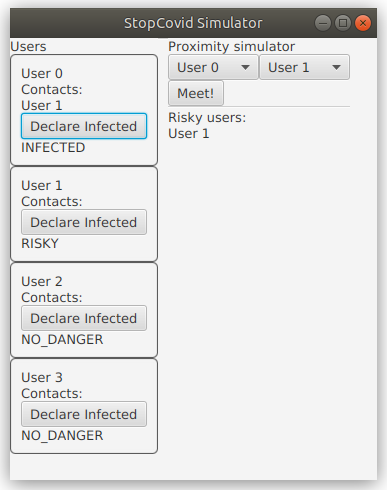

# MIF01 - TP Remise en route JAVA

**Objectif :**

Il vous est demandé de mettre en place quelques classes pour vous
remettre en tête les grands principes de la programmation orientée
objet : messages et collaboration entre objets, attributs et méthodes,
constructeurs, héritage, etc. Pour cela, vous manipulerez un simulateur
reproduisant très grossièrement le comportement de l'application
[StopCovid](https://fr.wikipedia.org/wiki/StopCovid).

Votre travail servira de base aux TPs suivants qui feront l'objet d'une
note globale (voir le fichier [projet-note.md](projet-note.md) pour les consignes
sur l'ensemble du projet).
Le travail se fait en binômes. Si vous ne trouvez pas de binôme, des
binômes seront formés arbitrairement.

## Environnement

Pour développer en Java durant le TP, vous pouvez choisir d'utiliser :

- De préférence, un environnement de développement intégré (comme VSCode,
  Eclipse, Netbeans ou IntelliJ IDEA) qui permet de compiler, de générer un
  projet, de débugger et d'exécuter. 
- N'importe quel éditeur de texte avec coloration syntaxique, et
  effectuer la compilation et l'exécution en ligne de commande.

Vous pouvez travailler au choix sous Linux ou sous Windows.

### Sur les machines du Nautibus sous Linux

Sur les machines du Nautibus, les TPs ont été testés sous Linux, en
utilisant l'environnement Java installé pour vous dans
`/home/tpetu/m1if01/`.  Avant de démarrer le TP, ajoutez ceci dans
votre fichier `~/.bashrc`:

    PATH=/home/tpetu/m1if01/bin:"$PATH"

Puis rechargez le fichier (`exec bash` par exemple). Vérifiez que vous
obtenez bien :

    $ which java
    /home/tpetu/m1if01/bin/java
    $ which javac
    /home/tpetu/m1if01/bin/javac
    $ which mvn
    /home/tpetu/m1if01/bin/mvn

### Sur les machines du Nautibus sous Windows

TODO

### Sur vos machines personnelles

Sur vos machines personnelles, en cas de problème sous Linux, il peut
être nécessaire d'installer JavaFX explicitement (`sudo apt install
openjfx` sous Ubuntu 18.04, ou bien téléchargement depuis
[openjfx.io](https://openjfx.io)). Le TP a été testé avec Java 11, il
ne marchera probablement pas sans adaptation avec d'autres versions (il faudra au moins modifier la version de JavaFX dans `pom.xml`).

Si vous avez installé JavaFX via votre distribution et que Java ne
trouve pas les classes JavaFX, ajoutez explicitement les fichiers JAR
concernés à votre classpath, avec quelque chose comme :

    CLASSPATH="$CLASSPATH":/usr/share/java/openjfx/jre/lib/ext/jfxrt.jar
    CLASSPATH="$CLASSPATH":/usr/share/java/openjfx/jre/lib/jfxswt.jar
    export CLASSPATH

Sur machines personnelles, vérifiez que vous avez bien `git` et `mvn`
installés :

    $ git --version
    git version 2.17.0
    $ mvn --version
    Apache Maven 3.5.2
    [...]

Si ce n'est pas le cas installez-les. Sous Ubuntu, faire :

    apt install git maven

## Création d'un projet sur la forge et récupération du code

Ouvrez dans votre navigateur
[forge.univ-lyon1.fr](http://forge.univ-lyon1.fr). Si vous vous
connectez pour la première fois, le système vous permettra de
vérifier/modifier les informations qui vous concernent, idem pour
votre éventuel binôme. Ajoutez ce dernier comme développeur de votre
projet (Configuration → Membres).

Nous allons utiliser le dépôt Git du cours comme base pour votre
projet. Ouvrez la page
[https://forge.univ-lyon1.fr/matthieu.moy/m1if01-2019](https://forge.univ-lyon1.fr/matthieu.moy/m1if01-2019),
et cliquez sur le bouton « fork ». Ce bouton vous permet de récupérer
une copie du projet sur votre espace de la forge.

**IMPORTANT**: pour l'instant, le fork de votre projet est public sur
la forge. Nous vous demandons **impérativement de passer ce projet en
« privé »** pour que vos collègues ne puissent pas recopier votre code.
En cas de copie, nous sanctionnerons sévèrement les étudiants ayant copié **et**
ceux ayant laissé copier leur code. Pour rendre votre projet privé,
rendez-vous dans « settings → general » en bas de la barre latérale de
gauche, puis « Permissions ». Le premier réglage est « Project
visibility ». Dans le menu, choisissez « private », puis cliquez sur
le bouton « save changes ».

Pour vérifier que votre projet est bien privé (indispensable),
retournez à la page d'accueil de votre projet
(`https://forge.univ-lyon1.fr/votre.nom/m1if01-2019`) et copiez l'URL.
Ouvrez une fenêtre de navigation privée
(<kbd>Control</kbd>+<kbd>Shift</kbd>+<kbd>P</kbd> sous Firefox,
<kbd>Control</kbd>+<kbd>Shift</kbd>+<kbd>N</kbd> sous Chrom{e,ium}), et collez l'URL de votre projet
dans la barre d'URL. Comme le projet est privé, vous devez avoir le
message « You need to sign in or sign up before continuing. ». Si ce
n'est pas le cas, vous avez raté quelque chose, recommencez la
manipulation.

Pour vos projets futurs, vous pourrez aussi créer des projets à partir
de zéro. Pour cela, vous pourrez faire simplement « new project »
(bouton **+** en haut de l'écran).

Récupérez une copie locale du code avec la commande (l'URL est à
ajuster et vous est donnée par la forge quand vous ouvrez votre projet
avec votre navigateur) :

```
git clone https://forge.univ-lyon1.fr/votre.nom/mif01-2020.git
cd mif01-2020
```

[En cas de problème, voir la faq de la forge](https://forge.univ-lyon1.fr/EMMANUEL.COQUERY/forge/wikis/FAQ).

## Premier contact avec le projet

On vous fournit un squelette [stopcovid/](../stopcovid/). Si ce n'est
pas encore fait, faites un `git clone` de l'ensemble des supports du
cours, et retrouvez ce répertoire (`stopcovid`) dans votre
clone.

Le projet utilise l'outil Maven pour la compilation. Nous en parlerons
plus en détails en CM, pour l'instant vous devez seulement savoir :

- Le projet est décrit dans le fichier `pom.xml`. Vous pouvez regarder
  le contenu de ce fichier mais vous n'avez pas besoin de le modifier
  pour ce TP.
  
- `mvn compile` compile le projet

- `mvn exec:java` lance le programme compilé

Vérifiez que vous pouvez lancer le programme depuis la ligne de
commande.

Le squelette contient ces classes :

- `view.JfxView` : une classe gérant l'interface graphique du simulateur de l'application StopCovid

- `view.StopCovidUserView` : une classe qui représente (affiche et manipule)
  les propriétés d'un utilisateur.

- `view.StopCovidServerView` : une classe qui représente (affiche et manipule)
  un serveur StopCovid, qui sert d'intermédiaire entre les utilisateurs.

- `App` : la principale, qui gère la création de l'application

Le squelette de code ne fait pas de séparation entre l'interface
graphique (tout ce qui est lié à JavaFX) et la logique métier.
Nous verrons plus tard que cette situation est plus
qu'imparfaite et vous demanderons de refactorer le code.

### Exemple d'utilisation

Lancez l'interface graphique (`mvn exec:java`).  StopCovid est
une application destinée à être installée sur les téléphones portables
des utilisateurs. Le principe est de mémoriser dans les téléphones
avec qui l'utilisateur a été en contact, et lorsqu'un utilisateur tombe
malade, il peut, par l'intermédiaire d'un serveur, prévenir les personnes
avec qui il a été en contact les derniers jours. L'application réelle est
bien plus complexe, mais pour notre simulateur, on considère simplement :

- Lorsque deux utilisateurs se rencontrent, chacun mémorise l'identifiant de l'autre (on appelle la liste des utilisateurs rencontrés les « contacts »).

- Lorsqu'un utilisateur se déclare malade, il envoie la liste de ses contacts au serveur, qui s'occupe de prévenir les utilisateurs. La vraie application StopCovid fait quelque chose de similaire, mais sans révéler l'identité des utilisateurs, en utilisant le protocole [ROBERT](https://www.inria.fr/sites/default/files/2020-04/Pr%C3%A9sentation%20du%20protocole%20Robert.pdf).

Sur la gauche de l'interface, on voit la liste des utilisateurs.
Un utilisateur peut être dans 3 états :

- `NO_RISK` initialement

- `INFECTED` si il a attrapé la maladie

- `RISKY` si il a été en contact avec un utilisateur infecté.

À droite de l'interface, vous pouvez simuler une rencontre entre les deux utilisateurs. Essayez de sélectionner deux utilisateurs différents dans les deux listes déroulantes, et cliquez sur « meet ». Vous devriez voir chaque utilisateur apparaître dans les contacts de l'autre sur la gauche de l'interface.

Cliquez maintenant sur le bouton « Declare infected » sur l'un des deux utilisateurs. Vous devriez voir l'utilisateur passer en « INFECTED », et son contact passer en « RISKY » :



### Documentation de Java et JavaFX

Consultez la documentation de [Java
11](https://docs.oracle.com/en/java/javase/11/docs/api/index.html) et de
[JavaFX Graphics](https://openjfx.io/javadoc/11/)
(la bibliothèque graphique utilisée).

### Chargement du projet dans Eclipse, IntelliJ ou Netbeans

Si vous souhaitez utiliser un IDE, votre IDE favori propose
probablement une prise en charge de Maven, et configurera donc le
projet automatiquement depuis le `pom.xml` :

- VSCode : installer le plugin [Java Extension Pack](https://marketplace.visualstudio.com/items?itemName=vscjava.vscode-java-pack) qui apporte le support du langage Java, de Maven, ... Faire menu File → Open Folder (Ctrl+k Ctrl+o) puis choisir le répertoire. Une section « Maven Projects » doit s'ajouter à la barre latérale de gauche, et vous pourrez sélectionner les actions à effectuer (`exec:java` dans la section `exec` pour lancer l'application).

- Eclipse : installer le plugin [m2e](http://www.eclipse.org/m2e/), puis importer le projet en
  temps que projet Maven (File → Import... → Maven → Existing Maven Projects). Au nautibus, Eclipse
  est installé dans `/home/tpetu/m1if01/bin/eclipse` avec m2e installé. Pour lancer l'application,
  on peut au choix utiliser « Run as ... » → « Java application » (mais cf. ci-dessous pour une
  erreur fréquente), ou « Run as ... » → « Maven Build... » puis choisir le goal « exec:java ».

- IntelliJ et Netbeans : le support de Maven est inclus de base dans l'outil. Il
  suffit d'ouvrir le répertoire contenant le `pom.xml`.

### Problèmes fréquents et solutions avec Eclipse

Il est possible qu'Eclipse signale une erreur ou un warning de
restriction d'accès lors de l'utilisation de javafx. Ce problème peut
être résolu en [modifiant les propriétés du projet pour autoriser
javafx](http://stackoverflow.com/questions/22812488/using-javafx-in-jre-8).
En résumé : clic droit sur le projet dans le project / package
explorer > Properties > Section Java Build Path > Onglet Libraries >
Selectionner Access Rules > Cliquer sur le bouton Edit > Cliquer sur
le bouton Add > Changer l'option "Forbbiden" en "Accessible" et
saisir `javafx/**` comme Rule pattern.

Si vous obtenez le message

> Error: JavaFX runtime components are missing, and are required to
> run this application

La solution se trouve ici : [https://stackoverflow.com/q/57159440/4830165](https://stackoverflow.com/q/57159440/4830165).

## Travail demandé

Dans un premier temps, conservez l'architecture (répartition en
classes et packages) fournie. Nous verrons bientôt comment réorganiser
le tout.

### Échauffement : type énuméré pour les statuts possibles

Notre base de code a bien des défauts, mais commençons par résoudre un détail : les 3 statuts possibles (`RISKY`, `INFECTED`, `NO_RISK`) sont gérés comme des chaînes de caractères directement dans le code de l'application. C'est une très mauvaise idée pour beaucoup de raisons : besoin de modifier la logique de l'application si on cherche à traduire dans une autre langue, difficulté à débugger le code en cas de typo (que se passe-t-il si quelqu'un écrit `status = "NO_RISK"` à un endroit, puis `if (status.equals("NO RISK"))` ailleurs ?), ... Une bien meilleure solution est d'utiliser un type énuméré, qui sera utilisé dans la logique de l'application mais pas nécessairement dans l'affichage.

Vu que ce type énuméré ne concerne pas l'affichage, il n'a pas sa place dans le paquet `view`. Créez un paquet `model` à côté de `view` (nous verrons plus tard que dans le principe MVC, le modèle contient la logique métier de l'application), et créez-y le type énuméré `StopCovidUserStatus` :

```java
package fr.univ_lyon1.info.m1.stopcovid_simulator.model;

public enum StopCovidUserStatus {
    RISKY, INFECTED, NO_RISK
}
```

puis utilisez ce type énuméré partout où les chaînes `"RISKY"`, `"INFECTED"` et `"NO_RISK"` apparaissent dans votre base de code. Mieux, vous pouvez faire en sorte que l'affichage produise des chaînes plus agréables comme `Risky`, `Infected` et `No Risk` (cf. par exemple https://openclassrooms.com/fr/courses/26832-apprenez-a-programmer-en-java/22162-decouvrez-les-enumerations si vous ne voyez pas comment faire).

### Limiter les contacts transmis au serveur

Pour l'instant, les utilisateurs sont notifiés même s'ils n'ont été en contact que très brièvement avec une personne infectée. Pour réduire les faux-positifs, on propose de ne considérer comme `RISKY` une personne que si elle a été en contact au moins 2 fois avec une personne nouvellement infectée (dans l'application StopCovid réelle, le critère est d'avoir été en contact au moins 15 minutes). Modifiez le code pour afficher dans la liste des contacts des utilisateurs le nombre de fois où un utilisateur a été en contact, et modifiez la logique pour ne transmettre au serveur que les utilisateurs qui ont été en contact au moins 2 fois lorsqu'un utilisateur se déclare infecté.

Cet exercice est un peu plus difficile qu'il devrait l'être avec la base de code fournie, qui mélange vraiment l'interface (vue) et la logique de l'application (modèle). Une fois notre application mieux organisée, l'exercice serait bien plus simple.

### Problèmes avec la base de code fournie

Réfléchissez maintenant à l'architecture du code. Posez-vous les
questions suivantes :

- Est-ce facile de modifier l'interface graphique sans changer la
  fonctionnalité ?
  
- À l'inverse, la modification de l'algorithme choisissant les contacts à transmettre au serveur devrait être indépendant de l'interface graphique. Est-ce que ça a été le cas quand vous avez fait la question ci-dessus ?
  
- Si vous deviez avoir plusieurs interfaces possibles (par exemple un
  mode « expert » et un mode « débutant » avec moins de boutons, ou
  une interface web et une interface graphique JavaFX), pourriez-vous
  le faire facilement ?
  
- Quelles sont les responsabilités de la classe `JfxView` ? Est-ce
  compatible avec le [Principe de Responsabilité
  Unique](https://en.wikipedia.org/wiki/Single_responsibility_principle) ?

Quelques éléments de réponses sont disponibles dans le fichier
[architecture-et-dependances.md](architecture-et-dependances.md). Ne
les lisez pas avant d'y avoir réfléchi vous-mêmes.

## Si vous avez fini ...

Passez au [lab2](../TP2-outils) !
